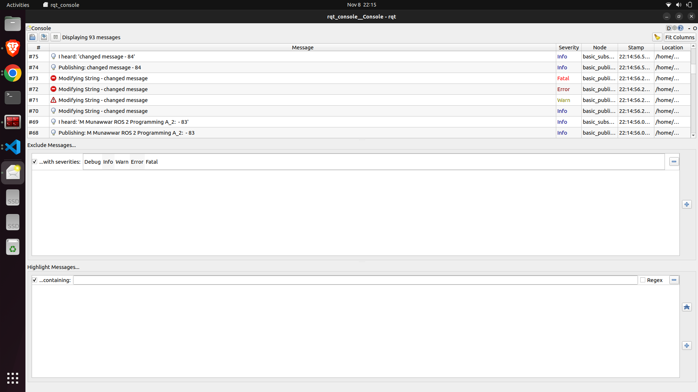

# ROS 2 Beginner Tutorials - ENPM700
### Author : **Mohammed Munawwar**
This repository is a simple publisher-subscriber package developed for ROS 2 beginner tutorials.

## Building the Project

   ```bash
   # Source the ROS 2 setup script to configure your environment
   source /opt/ros/humble/setup.bash

   # Create a new ROS 2 workspace directory
   mkdir -p ~/my_beginner_tutorials/src && cd ~/my_beginner_tutorials/src

   # Clone the repository
   git clone https://github.com/mun0404/my_beginner_tutorials.git

   # Install package dependencies using rosdep
   cd ..
   rosdep install -i --from-path src --rosdistro humble -y

   # Build the package using colcon
   colcon build

   # Source the package
   source ./install/setup.bash
   ```

## Running the nodes

```bash
# To run the publisher node
ros2 run beginner_tutorials talker

# To run the subscriber node
ros2 run beginner_tutorials listener
```

## Style check

Perform these to ensure the quality of the code is maintained:
cppcheck, cpplint and clangd.

```bash
# Run cppcheck for code analysis
cppcheck --enable=all --std=c++17 --suppress=missingIncludeSystem $(find . -name "*.cpp" | grep -vE -e "^./build/") --check-config > results/cppcheck.txt

# Run cpplint for style checking
cpplint --filter=-build/c++11,+build/c++17,-build/namespaces,-build/include_order src/*.cpp > results/cpplint.txt

# Run clang tidy
clang-tidy -extra-arg=-std=c++17 src/*.cpp

# To save the results of clang tidy
echo $? > results/clangtidy_output.txt
```
### 2: Services, Logging, and Launch files
 - 
   
   ```bash
   # Service call to modify published message.
   ros2 service call /change_string beginner_tutorials/srv/NewStr "{new_message: changed message}"

   # Using launch file.
   ros2 launch beginner_tutorials publisher_subscriber_services.launch.py

   # Using launch file to change the publisher frequncy from the default frequency of 2.0.
   ros2 launch beginner_tutorials publisher_subscriber_services.launch.py freq:=0.5

   # To view rqt_console.
   ros2 run rqt_console rqt_console
   ```

    
